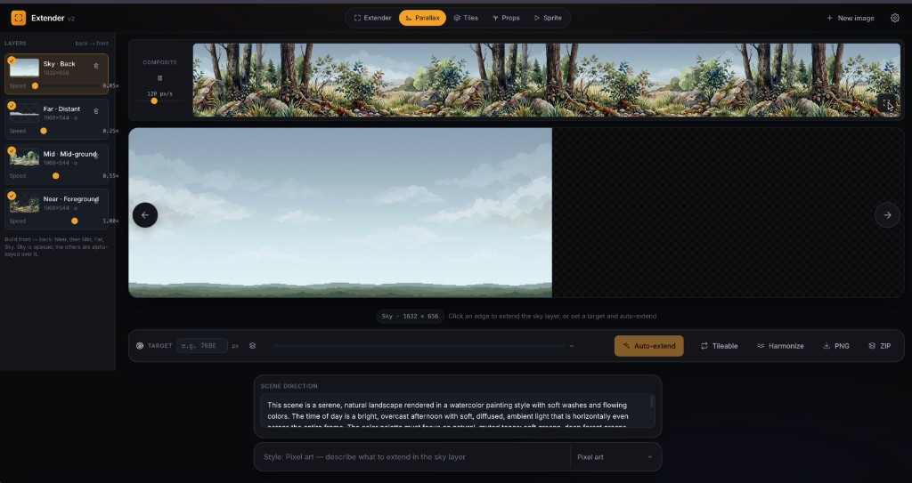

# Image Extender

[English](README.en.md) | 简体中文

> 用 AI 将任意图片向任意方向无缝扩展——并在同一个工作台中继续生成完整的 2D 游戏美术资源（视差背景、地块、精灵动画、装饰素材）。

这是一个小而完整的开源 Web 应用，既支持 AI 扩图（outpainting），也支持 2D 游戏美术生成。  
默认通过 [OpenRouter](https://openrouter.ai) 调用 Google Gemini 图像模型，内置 Poisson 融合流程用于隐藏原图与生成区域的接缝，同时提供专门针对地块、精灵、装饰素材的流水线。

自带你的 OpenRouter API Key 即可使用——密钥默认保留在浏览器本地，不会写入服务端。


## Before / After

一张 1024 × 1024 的手机人像图，可以在几次点击内变成 16:9 电影宽幅。  
颜色、光照、地面反射保持一致，只是画面内容变得更多。

| Before · 1024 × 1024 | After · 向左+向右扩展成电影宽幅 |
| --- | --- |
|  |  |

## Five modes — Extender + Parallax + Tiles + Sprites + Props

应用是一个五工作区的小型工作台，可在顶部模式切换栏中切换：

- **Extender**（默认）— 对任意图片执行四方向扩图，并提供 best-of-3 候选结果选择。
- **Parallax Studio** — 从零构建多层横版卷轴背景：**Sky / Far / Mid / Near** 分层、按层角色提示词、透明层抠图、实时滚动预览、按目标宽度自动扩展、无缝循环修复，以及一键 ZIP + JSON 清单导出。
- **Tile Studio** — 面向 2D 平台游戏的 13 格自动地块集（主体 + 4 边 + 4 外角 + 4 内角），以 **一次** AI 调用生成 4×4 图集，并带确定性角块修复与 AI “美术总监”评审/重绘循环。整套纹理细节与配色更稳定。
- **Sprite Studio** — 角色/生物动画表单次生成。可选 **体型方案**（人形、四足、蛇/鱼、飞行/鸟、史莱姆），再选动作并描述角色，得到关键帧表、实时动画预览与引擎可用导出。每个体型方案使用对应的骨架引导与动作集合。
- **Props Studio** — 透明装饰素材库（用于叠加在地块上方的散布素材），每次新增 8 个，采用“美术总监 → 绘制器”双调用流程，尽量减少重复素材。

### Parallax Studio


### Tile Studio


### Props Studio


### Sprite Studio


## Features

- **点击边缘即可扩展对应方向。** 空间化交互，不用复杂弹窗流程。
- **Best-of-3 候选选择。** 每次扩展最多生成 3 个候选，并按接缝质量排序；可用 `← →` 切换后再接受。
- **Poisson 接缝融合。** 使用梯度域图像编辑（Pérez et al., 2003），配合 mask-grow 与 replicate-padded Gauss-Seidel 迭代，使边界更自然。
- **低频色偏预校正。** 融合前先把 AI 区域在接缝附近整体拉回原图色调，降低“天空越来越蓝”这类扩图常见漂移。
- **可选提示词 + 美术风格。** 可留空做纯续画，也可加入“地平线升起外星月亮”等定向描述。
- **丰富美术风格。** 内置 40+ 风格（电影感、油画、吉卜力、赛博朋克、蒸汽波等）。
- **BYOK（自带密钥）。** OpenRouter key 存在浏览器 `localStorage`，服务端只做转发，不持久化。
- **模型切换。** 可在设置中选择 Gemini 3 Pro Image / Gemini 3 Flash Image / Gemini 2.5 Flash Image，并匹配不同参数。
- **键盘优先。** `↑↓←→` 扩展、`←/→` 切候选、`Enter` 接受、`R` 重生、`Esc` 丢弃。
- **从零生成底图。** 没有底图时，可先文生图再扩展。
- **共享场景简述。** 从提示词自动提炼“场景设定/时间/配色/氛围”，复用到视差、地块、精灵、装饰，保证项目观感统一。

### Parallax Studio (for game designers)

- **真实 4 层深度。** Sky（后层不透明）、Far（远轮廓）、Mid（中景）、Near（前景装饰）。左侧选层后单独编辑；底层仍复用扩图流水线。
- **按层角色提示词。** 生成/扩展某层时会显式告知模型层角色。Far/Mid/Near 默认在洋红底（`#FF00FF`）上渲染，前端再抠成 alpha，叠合更干净。
- **实时多层预览。** 每层独立 `repeat-x` 滚动，速度可调（Sky 慢、Near 快），导出前可直接看景深表现。
- **横向扩展锁定。** 仅开放 `←` 和 `→`，避免纵向扩展破坏游戏高度。
- **自动扩到目标宽度。** 设置目标（如 7680px = 4 × 1080p）后自动循环扩展并自动接受最佳候选，直到达标；可随时 `Stop`。
- **循环无缝修复。** `Tileable` 采用“半幅错位 → 修复中缝 → 还原”的典型流程，让横向循环尽量看不出接头；自动扩展完成后也会自动执行。
- **统一色调（Harmonize）。** 解决多轮扩展导致的纵向“面板色带”问题，通过列均值平滑减少累积亮度/色偏。
- **宽度预设。** 内置 3840 / 5120 / 7680 / 10240 / 15360 等常用目标。
- **一键 ZIP 导出。** 导出所有已填充层 PNG（保留 alpha）+ `parallax.json`（层顺序、速度、尺寸）。

### Tile Studio (2D platformer autotiles)

- **13 格整套一次生成。** 主体、四边、四外角、四内角一次生成到 4×4 图集，避免 13 次单独调用造成材质漂移。
- **模板引导 image-to-image。** 不是让模型“凭空猜图集结构”，而是先给结构模板（洋红底、带洞几何），再做材质重绘，后续按固定坐标裁切角色格。
- **自动对齐 + 抠图。** 对齐模型输出到模板轮廓，再做针对地块的 chroma key；边缘地块会按轴向做可平铺处理。
- **确定性角块修复。** 角块最容易出缝，因此用规则化拼接而非完全相信原始角块；外角做边缘嫁接，内角仅修邻边接缝。
- **AI “美术总监”评审循环。** 生成后先合成预览，再交给视觉评审检查抠图、边缘帽沿一致性、配色统一、主体平铺性等；失败则返回修复建议并重绘。
- **保留最优候选。** 多轮中始终保留评分最好的版本，避免“最后一轮反而变差”。
- **主体平铺优化。** 对主体区域做更强 2D 无缝处理，减少明显网格感。
- **实时拼合预览 + 单块重生。** 可只重生单格；之后角块会再做协同修复。
- **引擎可用图集导出。** 支持带 2px extrude 边距的图集（减少采样漏色）+ 单格 PNG + manifest。
- **14 种材质预设。** 如苔藓石、红砖、雪峰石、橡木、火山岩、珊瑚礁等，均可再编辑。

### Sprite Studio (character animations)

- **两阶段 Anchor → Sheet 流程。** 直接单次多格生成常见角色漂移与缩放不稳；这里采用：
  - **Pass 1：锁角色**（生成中立参考图）
  - **Pass 2：画动作表**（携带参考图约束“每格角色一致”）
  - Anchor 可在动作切换间复用；`Re-roll character` 可重新抽角色。
- **五种体型方案。** 人形、四足、蛇/鱼、飞行/鸟、史莱姆，不同体型对应不同动作集与姿态引导。
- **按体型姿态引导。** 每种体型有程序化骨架引导图（类似 ControlNet 引导思路），提高动作结构稳定性。
- **双体检测。** 通过 alpha 像素分析检测“一格里出现两个角色”的常见失败，并触发重绘。
- **尺度归一。** 对每帧轮廓尺度做统计并归一，减少播放时“呼吸式忽大忽小”。
- **基线与水平对齐。** 脚底线统一、水平居中，减少回放抖动与滑步错觉。
- **按体型动作集。** 不同体型提供不同默认动作集合与 FPS。
- **实时播放器。** 支持循环/单次、播放暂停、拖动帧、调 FPS。
- **角色预设 chips。** 各体型都有一键角色原型起手。
- **引擎可用导出。** 可导出网格表、横条表、逐帧 PNG、manifest。

### Props Studio (scatter decoration)

- **可无限扩展素材库。** 不是固定 12 格，而是每次追加 8 个新素材，旧素材不回滚。
- **“总监 → 画师”双调用。** 第一次由文本模型决定“画什么”，第二次由图像模型执行“怎么画”，降低重复套路。
- **轻量文本去重。** 每个素材带类别标签，后续批次把类别统计作为约束，减少撞车。
- **跨批次风格锚定。** 会用已有素材小拼图做风格参照，维持配色/光照一致。
- **自由整理。** 可单个重生或删除，素材默认透明背景。
- **8 种场景预设。** 森林、洞窟、沙漠、雪地、火山、雨林、沼泽、糖果风等。
- **更可读的导出命名。** 导出文件优先使用描述名（如 `lantern.png`）而非纯序号。
- **图集 + ZIP 导出。** 支持透明图集 + manifest，或单图 + 图集 + 清单打包。

## The AI "Art Director" QA pattern

Tile 与 Props 共享“推理与绘制分离”的策略：

- **Props**：先“想画什么”（推理），再“实际绘制”（图像模型）。
- **Tiles**：先“生成”，再由视觉评审“指出可修复问题”，必要时重绘；并采用 keep-best 保底。
- **Sprites**：更偏确定性后处理（尺度、基线、双体检测），减少对视觉评审模型耗时依赖。

评审约束只关注“画师可修复的问题”，且失败时 fail-open，不会把流程彻底卡死。

## How extension works

```text
┌─────────────┐   1. 在指定方向扩画布，补浅灰空白   ┌───────────────────┐
│   原图      │ ───────────────────────────────────▶ │   扩展后画布      │
└─────────────┘                                      └─────────┬─────────┘
                                                              │
                                                              ▼
                                                   ┌─────────────────────┐
                                                   │  模型补画空白区域   │
                                                   └─────────┬───────────┘
                                                             │
                                                             ▼
                                                   ┌─────────────────────┐
                                                   │  接缝处色调预校正   │
                                                   └─────────┬───────────┘
                                                             │
                                                             ▼
                                                   ┌─────────────────────┐
                                                   │ Poisson 融合 + mask │
                                                   └─────────┬───────────┘
                                                             │
                                                             ▼
                                                   ┌─────────────────────┐
                                                   │  计算接缝残差并排序 │
                                                   │  （最多 3 候选）    │
                                                   └─────────────────────┘
```

横向扩展通常并行尝试多候选（不同温度），按接缝残差排序展示；你也可以优先选内容更喜欢的候选。  
纵向扩展走另一条更稳定的分块路径，通常一次即可。

## Quick start

```bash
git clone https://github.com/boona13/image-extender.git
cd image-extender
npm install
npm run dev
```

打开 [http://localhost:3000](http://localhost:3000)。首次进入会提示填写 OpenRouter API Key（浏览器本地保存，可在设置中修改）。

如果你使用的是 OpenAI 兼容中转，也可在 `.env.local` 中配置服务端兜底：

```bash
OPENROUTER_API_KEY=your-relay-key
OPENROUTER_BASE_URL=https://your-relay.example/v1
```

OpenRouter key 获取地址：<https://openrouter.ai/keys>

### Optional: server-side env fallback

如果你不希望在浏览器输入 key（如部署演示站），可复制 `.env.example` 到 `.env.local` 并填写：

```bash
cp .env.example .env.local
# edit .env.local and add your OPENROUTER_API_KEY
```

当该值存在时，对未携带客户端 key 的请求，服务端会自动兜底使用它。

`OPENROUTER_BASE_URL` 支持 `/v1` 基础地址或完整 `/chat/completions` 地址；  
`OPENAI_API_KEY` 与 `OPENAI_BASE_URL` 也可作为别名。

## Usage

| 操作 | 方法 |
| --- | --- |
| **切模式** | 顶部点击 `Extender / Parallax / Tiles / Sprite / Props` |
| **上传图片** | 拖拽上传、点击上传，或先文生图 |
| **扩展** | 点击四边手柄，或按 `↑ ↓ ← →`（视差仅 `← →`） |
| **切候选** | `← →` 键（或结果区切换按钮） |
| **接受/重生/丢弃/下载** | `Enter` / `R` / `Esc` / 下载按钮 |
| **选视差层** | 左侧层卡（Sky/Far/Mid/Near） |
| **调层滚速** | 每个层卡上的速度滑条 |
| **视差自动扩展** | 设目标宽度后点 `Auto-extend`，可点 `Stop` 中断 |
| **视差无缝化/统一色调** | `Tileable` 修循环接缝；`Harmonize` 抑制累积色漂 |
| **视差导出** | 点击 `ZIP` 导出所有层与 `parallax.json` |
| **生成地块** | 描述材质后一次生成整表 |
| **单块重生** | 地块格内点击火花按钮 |
| **导出地块** | 导出图集（含 extrude）+ 单格 PNG + 清单 |
| **选精灵体型** | `Humanoid / Quadruped / Serpent-Fish / Flyer-Bird / Blob` |
| **选精灵动作** | 点击动作 chips |
| **锁角色** | 选择角色后执行 `Lock character + <anim>` |
| **重生动作/角色** | 动作重生仅重画表；角色重生重走两阶段 |
| **精灵预览** | 播放/暂停 + 拖帧 + FPS |
| **精灵导出** | 网格表、横条表、ZIP + manifest |
| **生成装饰** | 选场景预设或自定义后添加一批 8 个 |
| **追加装饰** | 继续点击新增批次 |
| **整理装饰** | 悬停单个素材可重生/删除 |
| **导出装饰** | 图集 + 清单，或 ZIP 全量导出 |

## Tech stack

- **[Next.js 14](https://nextjs.org/)**（App Router）+ React 18 + TypeScript
- **[Tailwind CSS](https://tailwindcss.com/)**
- **HTML Canvas**（前端图像处理）  
  [app/utils/imageProcessor.ts](app/utils/imageProcessor.ts)
- **[JSZip](https://stuk.github.io/jszip/)**（浏览器端打包）
- **[OpenRouter](https://openrouter.ai)**（模型统一入口）
  - 图像：`google/gemini-3.1-flash-image-preview`（默认）等
  - 推理/评审：`google/gemini-2.0-flash-001`

## Project structure

```text
app/
├── api/
│   ├── extend/route.ts
│   ├── generate/route.ts
│   ├── scene-brief/route.ts
│   ├── prop-brief/route.ts
│   ├── tile-review/route.ts
│   └── sprite-review/route.ts
├── components/
│   ├── TopBar / CommandBar / Workspace / VariantSelector / Modals / icons
│   ├── ParallaxStudio.tsx
│   ├── TileStudio.tsx
│   ├── SpriteStudio.tsx
│   └── PropStudio.tsx
├── lib/
│   ├── app.ts / models.ts / artStyles.ts
│   ├── parallax.ts / tileset.ts / sprite.ts / props.ts
│   └── bodyPlans.ts
├── utils/
│   ├── imageProcessor.ts
│   ├── poseRig.ts
│   ├── rigCore.ts
│   └── rigs/
├── globals.css
├── layout.tsx
└── page.tsx
```

## Configuration knobs

| 常量 | 位置 | 默认值 | 含义 |
| --- | --- | --- | --- |
| `EXTENSION_PERCENT` | `app/lib/app.ts` | `38` | 每次扩展占当前尺寸比例 |
| `maxAttempts` | `app/lib/models.ts` | `1`–`3` | 横向扩展候选数 |
| `MAX_TILE_REVIEW_PASSES` | `app/page.tsx` | `2` | 地块额外评审重绘轮次 |
| `TILESET_TILE_SIZE` | `app/lib/tileset.ts` | `512` | 地块单格分辨率 |
| `TILESET_ATLAS_EXTRUDE_PX` | `app/lib/tileset.ts` | `2` | 图集外扩像素 |
| `PROP_BATCH` | `app/lib/props.ts` | `8` | 装饰每批数量 |
| `GROW_PX` | `app/utils/imageProcessor.ts` | `8` | Poisson mask 扩张像素 |
| `iterations` | `app/utils/imageProcessor.ts` | `250` | Gauss-Seidel 最大迭代次数 |

## Privacy & security

- 在 UI 中输入的 OpenRouter key 仅保存在浏览器 `localStorage`。
- 服务端不会落盘持久化该 key；仅请求转发时使用。
- `OPENROUTER_API_KEY` 仅作为服务端兜底。
- `OPENROUTER_BASE_URL` 可指向兼容中转。
- 无埋点、无遥测、无跟踪。

## Acknowledgments

- **Pérez, Gangnet, Blake (2003)** — Poisson Image Editing
- Google Gemini 图像模型生态
- OpenRouter

## License

[MIT](LICENSE)
